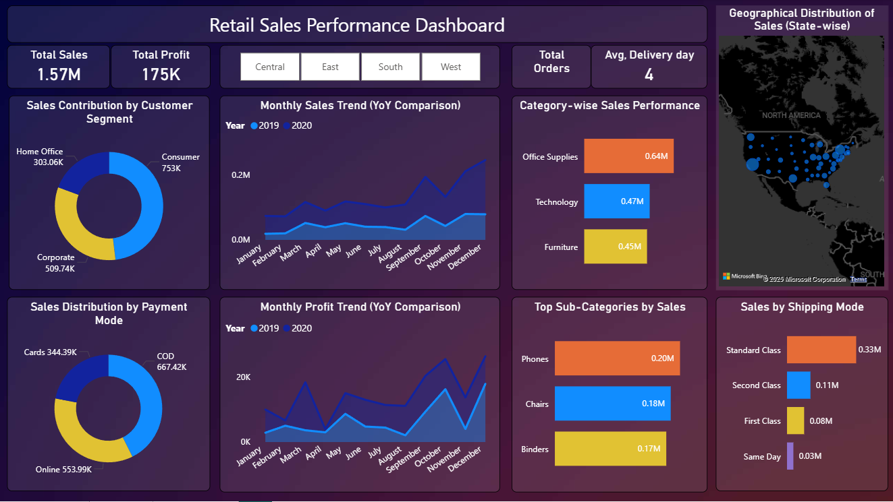
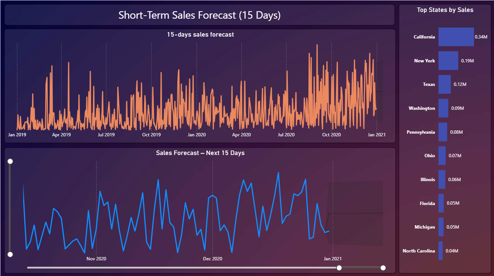

# Retail Sales Performance Dashboard (Power BI)

## Overview
This project presents an interactive Power BI dashboard developed to analyze retail sales performance, profit trends, and overall business KPIs. The dashboard enables users to explore sales behavior across categories, regions, and time periods to support data-driven decision-making.

## Project Objective
The objective of this project is to provide a clear and structured view of sales and profit performance, identify trends and patterns, and highlight key areas that impact business outcomes.

## Key Features
- Key performance indicators (KPIs) including Total Sales, Total Profit, and Total Orders
- Monthly Sales and Profit trends with Year-over-Year (YoY) comparison
- Category-wise and Sub-Category-wise performance analysis
- Region-wise and State-wise sales distribution
- Customer Segment, Payment Mode, and Shipping Mode insights
- Short-term sales forecasting to understand near-future trends

## Tools & Technologies
- Power BI
- DAX
- Data Modeling
- Data Visualization

## Business Use Case
This dashboard can be used by business and analytics teams to:
- Monitor sales and profit performance at a glance
- Identify high-performing and underperforming categories
- Analyze regional sales distribution
- Support short-term planning using sales forecasts

## Dashboard Preview
Below are screenshots from the Power BI dashboard:

### Sales Performance Overview

### Sales Forecast

